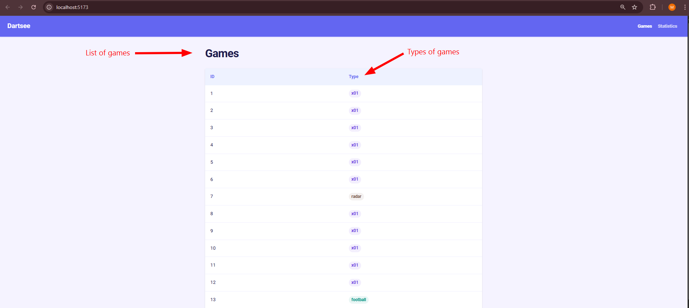
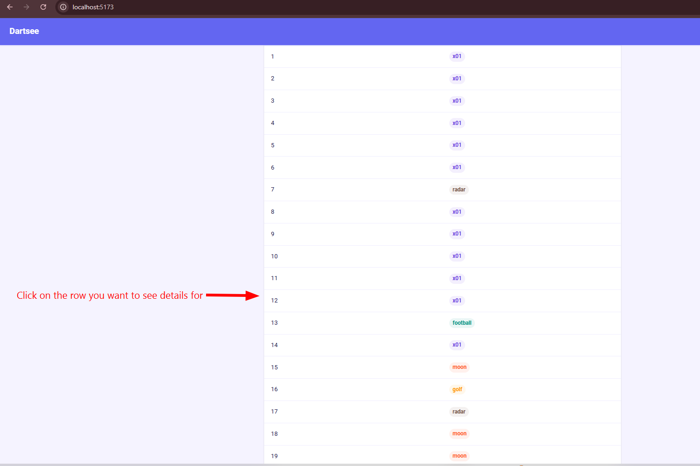
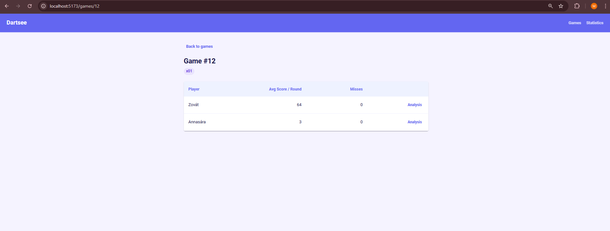
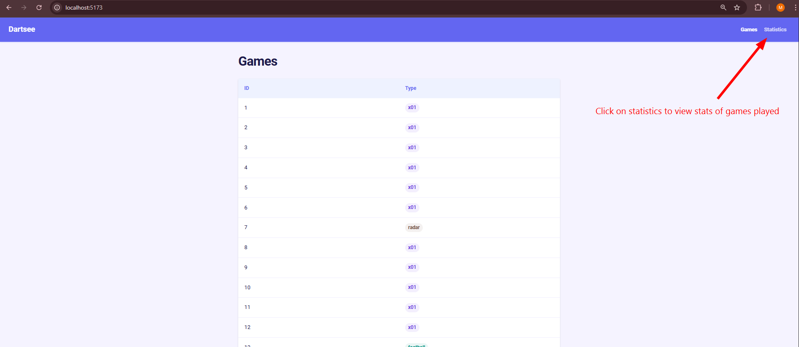
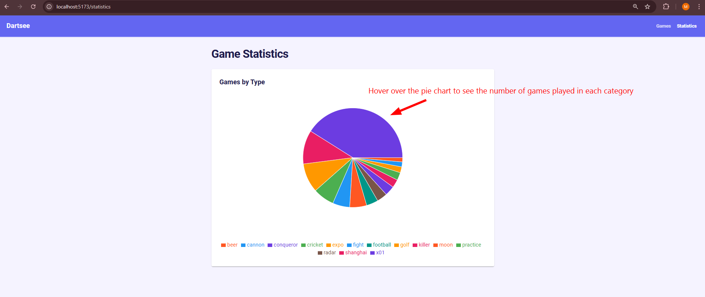
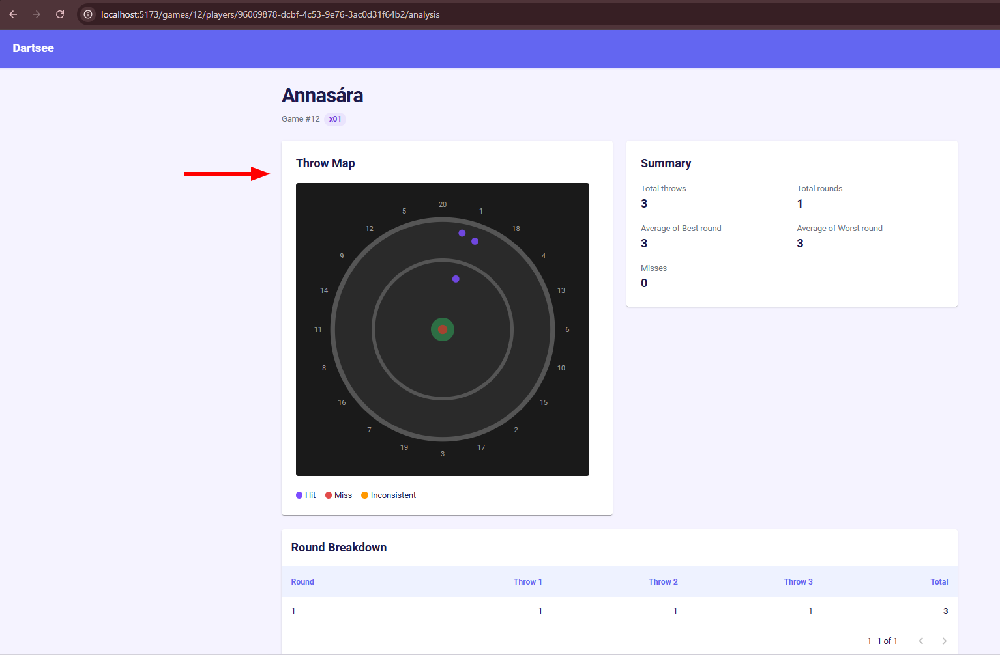
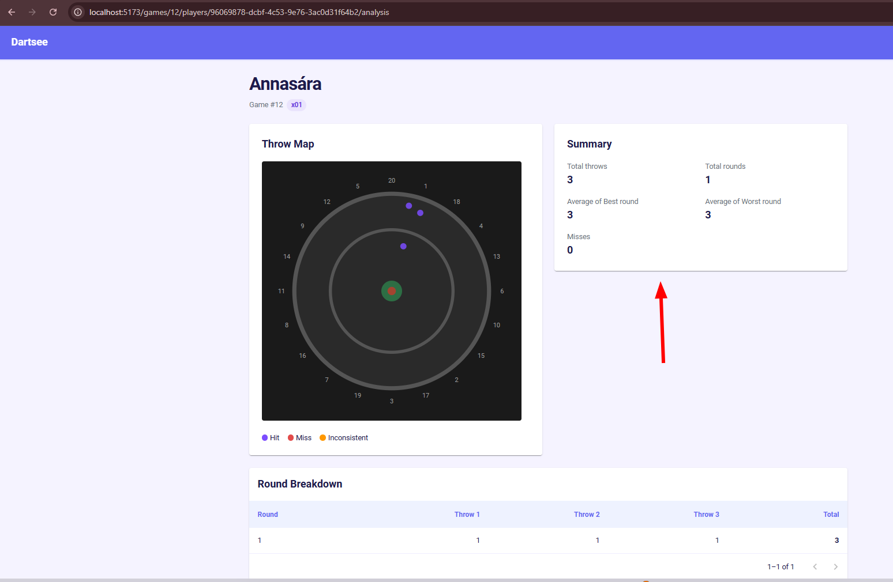
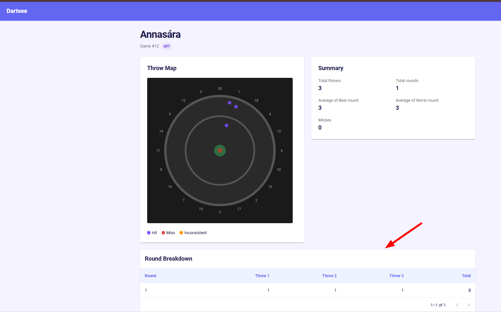

# Dartsee Application

A full-stack web application for visualising dart game statistics collected by Dartsee auto-scoring systems.

---

## Table of Contents

- [What is this project](#what-is-this-project)
- [Tech Stack](#tech-stack)
- [Monorepo Structure](#monorepo-structure)
- [Getting Started](#getting-started)
- [Project Structure](#project-structure)
- [Features](#features)
- [Data Handling](#data-handling)
- [Documentation](#documentation)
- [Troubleshooting](#troubleshooting)

---

## What is this project

Dartsee is a dart auto-scoring system. This application reads anonymised game data collected by the system and presents it in a visual, easy to navigate web interface.

The application allows users to:

- Browse all recorded dart games
- View detailed statistics per game including player scores and miss counts
- See a breakdown of game types played
- Analyse individual player performance with a dartboard throw visualization

---

## Tech Stack

| Layer    | Technology                               |
| -------- | ---------------------------------------- |
| Backend  | Node.js, Express 5, TypeScript           |
| Database | PostgreSQL (Docker)                      |
| Frontend | React 19, Vite, TypeScript, MUI          |
| Charts   | recharts                                 |
| API Docs | Swagger UI                               |
| Tooling  | pnpm workspaces, ESLint, Prettier, Husky |

---

## Monorepo Structure

This project uses **pnpm workspaces** — a single repository containing multiple packages that share tooling.

### Root level commands

| Command                  | Description                       |
| ------------------------ | --------------------------------- |
| `pnpm --parallel -r dev` | Start all packages in parallel    |
| `pnpm -r build`          | Build all packages                |
| `pnpm -r test`           | Run tests across all packages     |
| `pnpm lint`              | Lint all packages                 |
| `pnpm format`            | Format all packages with Prettier |

To run backend or frontend individually refer to their respective documentation:

- [Backend](docs/backend.md)
- [Frontend](docs/frontend.md)

---

## Getting Started

### Prerequisites

- Node.js v22+
- pnpm v10+
- Docker Desktop

## Getting Started

### Prerequisites

- Node.js v22+
- pnpm v10+
- Docker Desktop

Install the prerequisites for your platform below, then return here to complete setup.

---

### 🍎 macOS Users

<details>
<summary>👉 Click here for macOS setup</summary>

#### 1. Install Node.js

We recommend using [fnm](https://github.com/Schniz/fnm) (Fast Node Manager) to manage Node versions.

```bash
# Install fnm via Homebrew
brew install fnm

# Add fnm to your shell (add this to ~/.zshrc or ~/.bashrc)
eval "$(fnm env --use-on-cd)"

# Install Node.js v22
fnm install 22
fnm use 22

# Verify
node --version  # should be v22.x.x
```

> Alternatively, download the installer directly from [nodejs.org](https://nodejs.org/).

#### 2. Install Docker Desktop

1. Visit the [Docker Desktop for Mac](https://docs.docker.com/desktop/install/mac-install/) page.
2. Choose **Apple Silicon** (M1/M2/M3/M4) or **Intel Chip** based on your Mac.
   - Not sure which? Click → **About This Mac** and check the chip name.
3. Open the downloaded `.dmg` file and drag Docker to your **Applications** folder.
4. Launch Docker from your Applications folder. You should see the 🐳 whale icon in your menu bar.
5. Wait for Docker to finish starting (the whale icon stops animating).
6. Docker Desktop must be **running** before you complete the next steps
</details>

---

### 🪟 Windows Users (WSL2)

<details>
<summary>👉 Click here for Windows setup</summary>

> ❗ **Important:** Running natively on Windows is **not supported**. You must use **WSL2** (Windows Subsystem for Linux).

#### 1. Install WSL2

Open **PowerShell as Administrator** and run:

```powershell
wsl --install
```

This installs WSL2 and Ubuntu by default. Restart your machine when prompted.

After restarting, Ubuntu will launch and ask you to create a Linux username and password.

> If you already have WSL installed and want to confirm you're on version 2:
>
> ```powershell
> wsl --set-default-version 2
> wsl -l -v
> ```

#### 2. Install Node.js inside WSL2

Open your **Ubuntu** terminal and run:

```bash
# Install fnm
curl -fsSL https://fnm.vercel.app/install | bash

# Restart the terminal or reload your shell config
source ~/.bashrc

# Install Node.js v22
fnm install 22
fnm use 22

# Verify
node --version  # should be v22.x.x
```

#### 3. Install Docker Desktop

1. Visit the [Docker Desktop for Windows](https://docs.docker.com/desktop/install/windows-install/) page and download the installer.
2. Run the installer and make sure **"Use WSL 2 instead of Hyper-V"** is checked.
3. After installation, open Docker Desktop.
4. Go to **Settings → Resources → WSL Integration**.
5. Enable integration for your Ubuntu distro (toggle it on).
6. Click **Apply & Restart**.

> Docker Desktop must be **running** before you complete the next steps

> ⚠️ Always work inside the WSL2 filesystem. Working from the Windows drive causes severe performance issues and may cause file-watching tools (like Vite) to not work correctly.

</details>

---

### Setup

```bash
# 1. Clone the repo
git clone git@github.com:YOURUSERNAME/dartsee_application.git
cd dartsee_application
```

> If you don't have SSH set up, you can clone with HTTPS instead:
>
> ```bash
> git clone https://github.com/YOURUSERNAME/dartsee_application.git
> ```

```bash
# 2. Enable Corepack
corepack enable
```

> If you get a permission denied error, run `sudo corepack enable`.
> If corepack is not found, run `npm install -g corepack` first, then `corepack enable`.

```bash
# 3. Copy env files
cp .env.example .env
cp backend/.env.example backend/.env
```

<blockquote>
⚠️ <strong>IMPORTANT:</strong> Before continuing, you must set up the database SQL files.<br>
Follow the <a href="docs/database.md#setup">Database Guide setup section</a> and return here when done.
</blockquote>
<br>

```bash
# 4. Install dependencies
pnpm install


# 5. Start all packages in parallel
pnpm dev
```

Once everything is running, open your browser and navigate to:

| Service  | URL                                                              |
| -------- | ---------------------------------------------------------------- |
| Frontend | [http://localhost:5173](http://localhost:5173)                   |
| Backend  | [http://localhost:3000](http://localhost:3000)                   |
| API Docs | [http://localhost:3000/api-docs](http://localhost:3000/api-docs) |

---

## Project Structure

```
dartsee_application/
├── backend/              ← Node.js + Express API
├── frontend/             ← React application
├── docs/                 ← Detailed documentation
├── database/             ← SQL files
├── .husky/
├── .vscode/              ← Editor settings and extension
├── .env                  ← Environment variables
├── .env.example          ← Environment variable template
├── .gitignore
├── .node-version         ← Pins Node.js version for nvm/fnm
├── .npmrc                ← Enforces engine-strict checks
├── .prettierignore
├── .prettierrc.yml       ← Prettier formatting rules
├── docker-compose.yml    ← PostgreSQL container
├── eslint.config.js      ← ESLint rules for all packages
├── package.json          ← Root package with shared scripts
├── pnpm-lock.yaml
├── pnpm-workspace.yaml   ← Defines monorepo packages
└── README.md
```

---

## Features

### Games List

Paginated list of all recorded dart games. Clicking a row navigates to the game detail view.



### Game Detail

Shows all players in a game with their average score per round and miss count. Each player has an Analysis button for detailed throw analysis.




### Game Statistics

Pie chart showing the distribution of game types across all recorded games. Colors are consistent with game type chips used throughout the app.




### Player Analysis (Bonus)

Detailed analysis of a player's performance in a specific game. Includes three sections:

**Throw Map** — SVG dartboard visualization plotting where each throw landed using x/y coordinates from the auto-scoring system. Throws are color-coded: purple for hits, red for misses, and orange for inconsistent data where the scoring system and coordinates disagree.



**Summary** — Key performance stats including total throws, total complete rounds, best round, worst round, and miss count.


**Round Breakdown** — Paginated table showing each round (group of 3 consecutive throws) with individual throw scores and round totals. Incomplete rounds are displayed but excluded from average calculations.



---

## Data Handling

### Scoring

Actual points per throw = `score × modifier` where:

- modifier 0 = miss (0 points, regardless of score value)
- modifier 1 = single (face value)
- modifier 2 = double (score × 2)
- modifier 3 = treble (score × 3)

### Round Calculation

A round is defined as 3 consecutive throws. Incomplete rounds at the end of a game are displayed but excluded from average calculations. Approximately 27% of player-game entries in the dataset have incomplete final rounds.

### Coordinate Data Quality

The auto-scoring system provides x/y coordinates on an 800×800 detection grid with the dartboard centered at (400, 400) with radius 300. Analysis of the dataset revealed:

- Some throws have coordinates outside the 0-800 range
- A small number of throws have valid scores but coordinates outside the board circle

The dartboard visualization plots throws with reliable coordinates and transparently reports throws that could not be mapped.

---

## Documentation

- [Backend](docs/backend.md)
- [Frontend](docs/frontend.md)
- [Database](docs/database.md) — schema reference

---

## Troubleshooting

### Database tables not found

The SQL files are loaded automatically on first container start. If tables are missing:

```bash
docker compose down -v
docker compose up -d
```

### pnpm install fails

Make sure you are using the correct pnpm version:

```bash
pnpm --version  # should be 10.32.1
```

### ESLint errors on commit

Husky runs ESLint before every commit. Fix the errors shown in the terminal before committing.

### Wrong pnpm or Node version

The project enforces specific versions. If you get an engine compatibility error:

1. Make sure Corepack is enabled: `corepack enable`
2. Make sure you're on Node 22+: `node --version`
3. If using nvm or fnm, run `nvm use` or `fnm use` — it will read `.node-version` automatically
